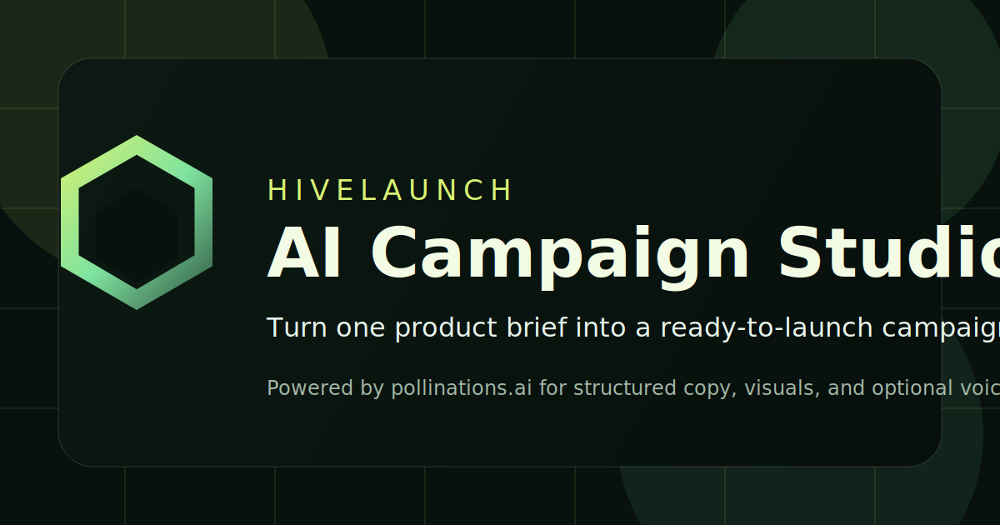

# HiveLaunch

Powered by [Pollinations.ai](https://pollinations.ai), HiveLaunch is a BYOP AI campaign studio that turns one product or service brief into a ready-to-launch mini campaign kit.

Live app: [https://skill-deploy-stvjb2min5-codex-agent-deploys.vercel.app](https://skill-deploy-stvjb2min5-codex-agent-deploys.vercel.app)



## What It Does

HiveLaunch is intentionally narrow. It is not a generic AI playground.

You enter:

- product or service name
- short description
- audience
- platform goal
- tone
- visual style
- brand colors
- offer or CTA
- language
- optional notes

HiveLaunch returns:

- one concept summary
- one audience insight
- three campaign angles
- three headline options
- three caption options
- three CTA options
- three image prompt recipes
- generated campaign visuals
- an optional voiceover script
- optional generated audio
- exportable Markdown, JSON, and ZIP bundles

## Why Pollinations

HiveLaunch visibly and directly uses Pollinations.ai for the core product flow:

- Pollinations text generation creates the structured campaign plan
- Pollinations image generation creates visual assets from generated prompt recipes
- Pollinations audio generation can turn the voiceover script into a playable MP3
- Pollinations BYOP authorization lets users connect their own account instead of relying on a hidden server key

The UI also includes visible Pollinations credit in the app footer and hero.

## Feature Highlights

- BYOP-ready "Connect with Pollinations" flow
- manual key mode for developer and reviewer testing
- local-only key persistence by explicit user choice
- live text and image model discovery with fallback defaults
- schema-validated campaign plans with graceful JSON recovery
- per-section regeneration for copy and prompts
- per-image aspect ratio presets for social, ads, and hero layouts
- local session history with reopen and delete actions
- Markdown, JSON, and ZIP exports
- no custom backend required for the core experience

## Pollinations BYOP In HiveLaunch

HiveLaunch supports two connection modes:

### 1. Manual key mode

- Paste a `pk_...` or `sk_...` Pollinations key
- HiveLaunch performs basic format checks
- The key is only saved locally if the user explicitly chooses to remember it
- The UI warns when a publishable key is being used

### 2. Connect with Pollinations

- The app builds the official Pollinations authorize URL
- Pollinations redirects back with `#api_key=...`
- HiveLaunch reads the fragment client-side
- The fragment is immediately removed from browser history
- The user can keep the key temporary or save it locally on that device

## Local Development

### Requirements

- Node.js 20+
- npm 10+

### Setup

1. Install dependencies:

   ```bash
   npm install
   ```

2. Create a local `.env` from `.env.example`

3. Start the app:

   ```bash
   npm run dev
   ```

4. Open the local Vite URL in your browser

## Environment Variables

| Variable | Required | Purpose |
| --- | --- | --- |
| `VITE_POLLINATIONS_APP_KEY` | Optional | Publishable Pollinations app key used for the BYOP authorize screen |
| `VITE_PUBLIC_APP_URL` | Recommended | Exact redirect URL used after Pollinations authorization |
| `VITE_DEFAULT_TEXT_MODEL` | Optional | Fallback text model before live discovery succeeds |
| `VITE_DEFAULT_IMAGE_MODEL` | Optional | Fallback image model before live discovery succeeds |

## Available Scripts

```bash
npm run dev
npm run build
npm run preview
npm run lint
npm run typecheck
npm run test
npm run check
```

## Project Structure

```text
src/
  components/         UI sections and product surfaces
  lib/                Pollinations client, auth, storage, export, utilities
  schema/             zod schemas and response parsing
  types/              shared TypeScript types
public/               favicon, manifest, OG art
.github/workflows/    CI
```

See [ARCHITECTURE.md](./ARCHITECTURE.md) for more detail.

## How Pollinations Is Wired

HiveLaunch uses official Pollinations endpoints directly from the browser:

- `GET /text/models`
- `GET /image/models`
- `POST /v1/chat/completions`
- `GET /image/:prompt`
- `GET /account/key`
- `GET /account/profile`
- `GET /account/balance`

The generation flow asks Pollinations for structured JSON, validates it with zod, and falls back to `json_object` mode if strict schema mode fails.

## Privacy And Key Handling

- No Pollinations key is hardcoded
- No real key is committed to source control
- Keys only live in browser memory unless the user explicitly saves one
- Saved keys and session history stay in local browser storage
- There is no database and no cloud account layer in HiveLaunch

## Deploying

HiveLaunch is designed for static hosting.

- [DEPLOY.md](./DEPLOY.md) covers Vercel and Netlify
- `vercel.json` and `netlify.toml` are included
- Set `VITE_PUBLIC_APP_URL` to the final deployed URL before testing BYOP

## Submission Prep

- Pollinations credit is visible in the product UI
- Pollinations credit is visible in this README
- The repo includes a near-ready submission draft at [POLLINATIONS_APP_SUBMISSION.md](./POLLINATIONS_APP_SUBMISSION.md)
- The initial release notes live in [CHANGELOG.md](./CHANGELOG.md)

## Repo Hygiene

- TypeScript strict mode
- ESLint
- Prettier
- Vitest
- GitHub Actions CI
- MIT license

## Attribution

Built with [pollinations.ai](https://pollinations.ai).

## License

[MIT](./LICENSE)
